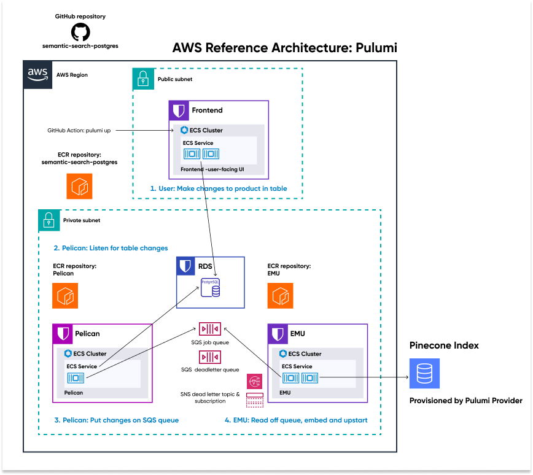

# Pinecone AWS Reference Architecture with Pulumi

# Introduction 
The Pinecone AWS Reference Architecture is a distributed system that performs vector-database-enabled semantic search over Postgres records. 
It is appropriate for use as a starting point to a more specific use case or as a learning resource. 

It is permissively licensed and supported by Pinecone's open-source
team in order to ease getting started with high-scale use cases for Pinecone's highly scalable vector database.

# Table of contents
* [Introduction](#introduction)
* [Getting started](#getting-started)
* [Detailed setup instructions](./docs/setup.md)
* [Core concepts](./docs/core-concepts.md)
* [Architecture overview](./docs/architecture.md)
* [Common tasks](./docs/common-tasks.md)
* [Troubleshooting and FAQs](./docs/troubleshooting-and-faq.md)
* [Code of conduct](./docs/code-of-conduct.md)
* [Contribution guidelines](./docs/contributing.md)
* [License](#license)

# Getting started: 

## Prerequisites
* [AWS account](https://aws.amazon.com/console/)
* [Free Pinecone account](https://app.pinecone.io)
* [Free Pulumi account](https://app.pulumi.com/)

## Quick start guide 
1. **Set Up AWS IAM User**

    * Create a New IAM User: In your AWS account, create a new IAM user.
    * Security Credentials: Generate new security credentials for this IAM user.
    * Attach Administrator Policy: Attach the Administrator IAM policy to your IAM user, either directly or by adding the user to an appropriate IAM group.

2. **Configure AWS Credentials**

    * Add Credentials to AWS Profile: Insert your IAM user's access key ID and secret access key into your `~/.aws/credentials` file.

3. **Install Pulumi CLI**

    * Download and [install the Pulumi CLI](https://www.pulumi.com/docs/install/?utm_source=pinecone&utm_medium=github&utm_campaign=pinecone-refarch).
    * Link GitHub Account: [Complete your Pulumi account setup](https://app.pulumi.com/?utm_source=pinecone&utm_medium=github&utm_campaign=pinecone-refarch) using your GitHub account.

4. **Configure Pulumi**

    * Set AWS Profile: Run `pulumi config set aws:profile <your-aws-profile-name>` to configure the AWS profile in Pulumi.

5. **Obtain Pinecone API Key**

    * [Log into Pinecone's dashboard or create a free account](https://app.pinecone.io) to obtain your Pinecone API key and environment values.

6. **Set Environment Variables**

    * Ensure the following environment variables are set: 
        * `PINECONE_API_KEY` (From your Pinecone account at https://app.pinecone.io)
        * `PINECONE_ENVIRONMENT` (From your Pinecone account at https://app.pinecone.io)
        * `PINECONE_INDEX` (You don't need to actually create this index. If it doesn't exist, the RefArch will automatically provision it)

7. **Initialize and Run Pulumi Stack**

    * Initialize Stack: Run `pulumi stack init <your-stack-name>`.
    * Deploy Resources: Execute `pulumi up` to start the deployment.
    * Review and Confirm: Review the Pulumi preview of resources to be created. Confirm by selecting `Yes` to proceed.

# License 

The Pinecone AWS Reference Architecture is licensed under [the Apache 2.0 license](./LICENSE).
